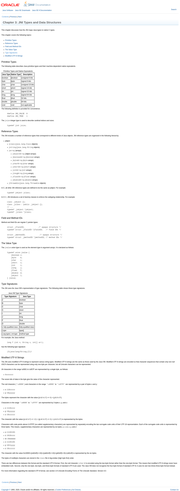
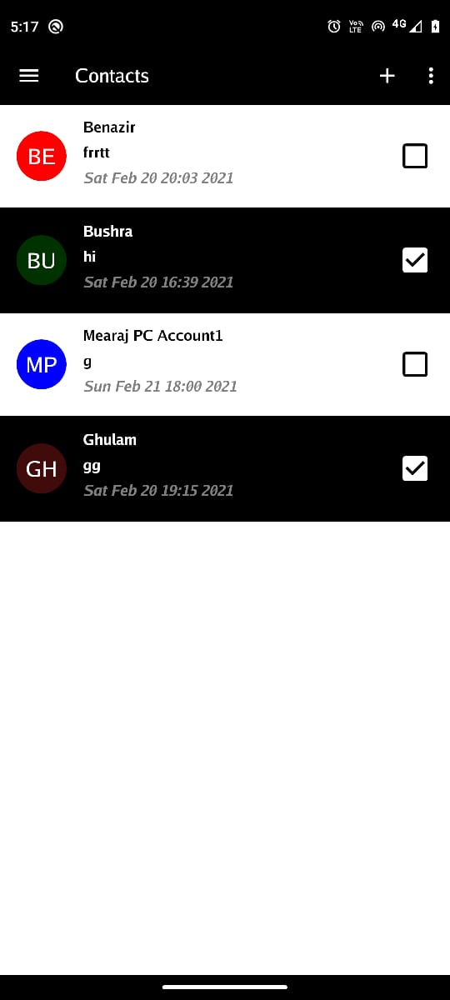
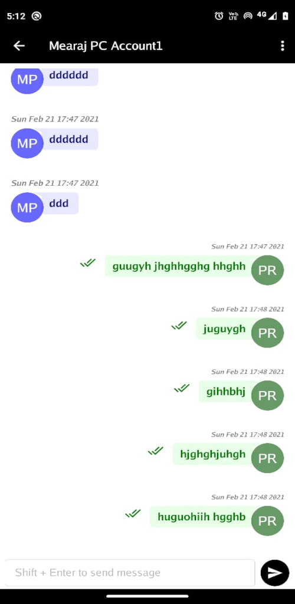

# [Protonet](https://play.google.com/store/apps/details?id=live.protonet)

A Cross-Platform, Multi-Communication, Serverless (Decentralized) App.

## About

Protonet is a communication app, based on modern techniques, intended to be a secure way of interaction, whether Text
Messaging or Voice Calling or Video Sharing or Purchasing Crypto Currencies or Using Crypto Currencies for shopping,
should be reliable and secure.

## Note

The app is in very early stage(alpha) and not recommended for production. It's also not well documented. You are welcome
to make any changes/improvement in this repo. This repo is for anyone interested!

## Playstore

Refer [Protonet](https://play.google.com/store/apps/details?id=live.protonet)

## [MIT Licensed](LICENSE)

You are free to use any code from this app. You are allowed to make pull request, etc as well. The intent of this app
was to help open source community and receive help from open source community and anyone interested and also to give a
glimpse of how powerful modern techonlogies. For third party libraries, please refer to their respective licenses.
Please also refer to [License](LICENSE) file.

## Technologies Glimpse

[Gioui](https://gioui.org/) a modern cross-platform UI Framework in Go language.<br>
[Libp2p](https://github.com/libp2p/go-libp2p) a modern cross-platform Networking Framework / Libraries in Go
language. <br>
There are other libraries used as well. Please refer to source code for that, especially go.mod files.

## Libraries

The app uses many third party open source libraries without which this project wouldn't be possible. For Gui, it mainly
uses [Gioui](https://gioui.org/) <br>
For networking, it mainly uses [Libp2p](https://github.com/libp2p/go-libp2p)

## Supported Platforms

Windows, Mac, Linux, Android, iOS, Modern Browsers<br>
The app is mainly tried on Linux,Android and Modern Browsers, for other platforms you may need to figure out a way.

## Prerequisites

You need to install [Go](https://golang.org/) for your platform

## Running

From commandline/terminal, cd into the root directory of this project, then make sure all the dependencies are
installed. Run `go get ./...`, followed by `go run .`

## Android Build

Make sure [AndroidStudio and AndroidSdk](https://developer.android.com/studio) is installed<br>
Run the following command inside the root directory of the project from terminal/commandline<br>
```gogio -target android .```<br>
The above command will generate protonet.live.apk, then<br>

```
adb devices
adb -s deviceIdFromAbove install protonet.live.apk
```

### Issues

* Error in ... #include<jni.h> No such file or directory Resolution
  ```CGO_CFLAGS="-I${JAVA_HOME}/include -I${JAVA_HOME}/include/linux" go get ./...```
  [Solution](https://stackoverflow.com/questions/56315690/running-go-get-github-com-libp2p-go-libp2p-results-in-error-messages)

### Deployment Refer link below and ```gogio -x -work -appid live.protonet -target android .```

[https://developer.android.com/studio/command-line/apksigner](https://developer.android.com/studio/command-line/apksigner)

# Deployment To Playstore

```
 gogio -buildmode archive -x -work -appid live.protonet -minsdk 22 -version 3 -target android
```

then delete protonet.apk, followed by

```
/pathToZipAlign/zipalign -f 4 /tmpPathFromAbove/app.ap_ protonet.apk
/pathToApkSigner/apksigner sign --ks yourkey.jks protonet.live.apk
```

# Web Assembly

go run gioui.org/cmd/gogio -target js . go get github.com/shurcooL/goexec goexec 'http.ListenAndServe(":8080",
http.FileServer(http.Dir("protonet.live")))'

## Useful References

https://github.com/golang/go/wiki/Modules#can-i-work-entirely-outside-of-vcs-on-my-local-filesystem
https://levelup.gitconnected.com/best-practices-for-webassembly-using-golang-1-15-8dfa439827b8
https://github.com/golang/go/blob/master/misc/wasm/wasm_exec.html
https://gist.github.com/SteveBate/042960baa7a4795c3565

### JNI References

[java_8_jni_type_signatures](https://docs.oracle.com/javase/8/docs/technotes/guides/jni/spec/types.html#type_signatures)



[Pick Image From Android](https://stackoverflow.com/questions/48194733/whats-the-way-to-pick-images-from-gallery-on-android-in-2018/48195899#48195899)

[Encrypt and Decrypt Text Message](https://pkg.go.dev/github.com/decred/dcrd/dcrec/secp256k1/v3#example-package-EncryptDecryptMessage)

## Screenshots



